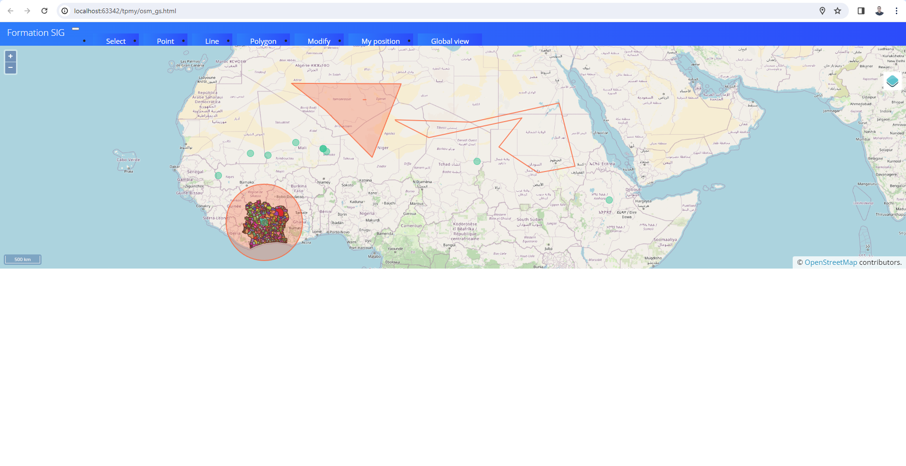

# Web Mapping Application  

## Overview  
This project is a web-based mapping tool designed to provide an interactive experience for working with geospatial data. Built using **HTML**, **JavaScript**,**Bootstrap**, **OpenLayers**, it offers users features like drawing custom geometries, real-time geolocation, and a responsive interface. 

Using GeoServer, a powerful map server, this project incorporates the following functionalities:  

- **Web Publication**: Facilitates the publication of spatial data as cartographic services accessible on the web.  
- **Data Management**: Supports the loading, configuration, and publication of both vector and raster data layers.  
- **Custom Styles**: Defines publication styles for vector data using Styled Layer Descriptor (SLD) standards.  
- **Web Integration**: Implements HTML and JavaScript programming to create an interactive map, utilizing jQuery, Bootstrap, and JSON for enhanced interactivity.  
- **Mapping API**: Leverages OpenLayers 6 Geolocation API for dynamic geolocation and web-based mapping functionalities.  

## Installation Steps  
1. Clone this repository to your local machine.  
2. Configure **GeoServer** for map layer management as per the setup guidelines.  
4. Open the `osm_gs.html` file in a web browser to launch the application.  

### Interactive Map  

 

## Contributors  
- Youssef Makhlouf  
- Mohamed Saket
- Amir Jribi

### Contact  
Feel free to reach out:  
- **LinkedIn**: [Youssef Makhlouf](https://www.linkedin.com/in/youssef-makhlouf-608aa622a/)  
- **Email**: [youssef.makhlouf@supcom.tn](mailto:youssef.makhlouf@supcom.tn)  
